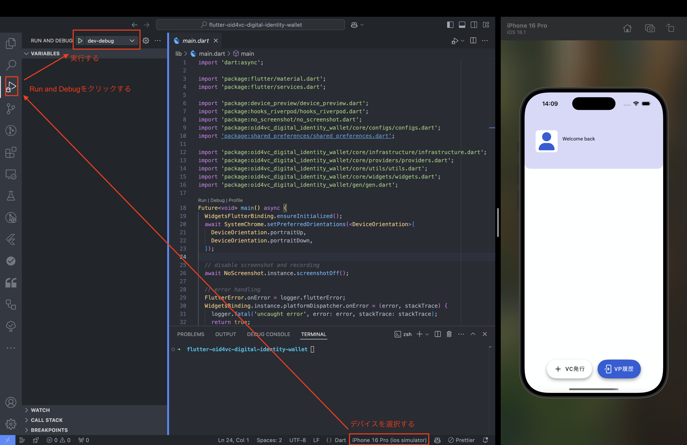

Flutter project.

## 開発環境構築
- 共通
  - [Android Studio](https://developer.android.com/studio)
  - Android SDK 34 (※Android Studio からインストールする)
  - 必要であれば、Android Emulatorをインストールする
- Windows
  - [Flutter SDK 3.27.1](https://docs.flutter.dev/release/archive)
  - [Open JDK 17](https://jdk.java.net/archive/)
- Mac OS
  - App StoreからXCodeをインストールする
  - 下記のコマンを実行し、Homebrewをインストールする
    ``` bash
    /bin/bash -c "$(curl -fsSL https://raw.githubusercontent.com/Homebrew/install/HEAD/install.sh)"
    ```
  - ターミナルで下記のコマンドを実行する
    ```bash
    # 初回のみ実行
    make init

    # Flutter SDKをインストールし、パッケージをダウンロード
    make install
    ```

## 各 Editor の設定
- VSCode: 推奨しているFlutter関連の拡張機能をインストールする
- Android Studio: https://docs.flutter.dev/get-started/editor?tab=androidstudio を参照し、 flutter プラグインをインストールする
- `flutter doctor -v` で指摘事項がなくなるようにする

## flutter の起動は VSCode 上から実行する
- 実行するデバイスを選択する
- Run and Debug をクリックする
- アプリを実行する


## 多言語対応
`/lib/i18n/*.json`を編集し、下記のコマンドを実行し、コードを生成する。
`Text` Widgetに`t.xxx`を渡す。
  ```bash
    dart run slang
  ```

## 他のMakeコマンド
  
  ```bash
  # build_runnerを実行する
  make build-runner

  # freezed、providerなどのファイルの変更を監視し、コード生成を行う
  build-runner-watch

  # import 文の並べ替えとコードのフォーマットを行う
  make lint-fix

  # パッケージをインストールし直す
  make clean

  # スプラッシュ生成を行う
  make gen-splash

  # lib/i18n/*.yamlの変更を監視し、多言語対応コード生成を行う
  make slang-watch

  # 新しいパッケージを作成する
  make create-package name={name}

  # 新しいプラグインを作成する
  make create-plugin name={plugin}
  ```
